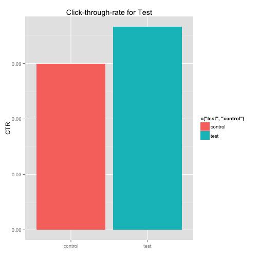

Experiment Results with Statistical Significance
========================================================
author: jjanzen
date: 6/13/15
transition: linear

Significance
========================================================

Have you ran a test and wondering if you have enough data?

Using the shiny app, it will do the math for you using:

- T-test (2-tailed)
- Chi-Squared

Entering the Data
========================================================

It doesn't get much easier to enter the four #s required. Here are the two methods:

- with keypad
- using the up or down arrows

Results
========================================================

You'll get four outputs:

- if T-Test is significant
- if Chi-Squared is significant
- the Control rate
- the Test rate

Bar Chart - Control vs Test
========================================================

 
